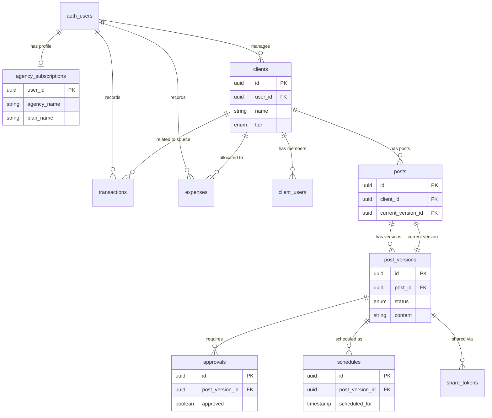

# Database Documentation

## Overview

This document serves as a reference for the Supabase database schema used in the Social Media Management application. The project ID is `ockvcyevnozuczzngrwg`.

## Enums

The database uses the following custom ENUM types:

### `client_tier`

- `BASIC`
- `PRO`
- `VIP`

### `post_status`

- `DRAFT`
- `PENDING_APPROVAL`
- `APPROVED`
- `SCHEDULED`
- `NEEDS_REVISION`
- `PUBLISHED`
- `ARCHIVED`

### `transaction_type`

- `INCOME`
- `EXPENSE`

### `transaction_status`

- `PAID`
- `PENDING`
- `OVERDUE`

## Tables

### `agency_subscriptions`

Stores agency profiles and subscription details. Linked to Supabase Auth users.

- **Primary Key**: `user_id` (uuid) -> `auth.users.id`
- **Columns**:
  - `plan_name` (text, default: 'PENDING')
  - `max_clients` (integer)
  - `max_storage_bytes` (bigint)
  - `current_storage_used` (bigint, default: 0)
  - `is_active` (boolean, default: true)
  - `whitelabel_enabled` (boolean, default: false)
  - `agency_name` (text)
  - `logo_url` (text)
  - `primary_color` (text, default: '#6366f1')
  - `social_links` (jsonb, default: '{}')
  - `industry` (text)
  - `platforms` (jsonb, default: '[]')
  - `email` (text)
  - `mobile_number` (text)
  - `description` (text)
  - `created_at` (timestamptz)
  - `updated_at` (timestamptz)

### `clients`

Represents clients managed by an agency.

- **Primary Key**: `id` (uuid)
- **Foreign Keys**:
  - `user_id` -> `auth.users.id` (The agency governing this client)
- **Columns**:
  - `name` (text)
  - `status` (text, check: ACTIVE, PAUSED)
  - `email` (text)
  - `mobile_number` (text)
  - `description` (text)
  - `logo_url` (text)
  - `tier` (`client_tier`, default: 'BASIC')
  - `industry` (text, default: 'General')
  - `platforms` (text[], default: '{}')
  - `is_internal` (boolean, default: false)
  - `social_links` (jsonb, default: '{}')
  - `created_at` (timestamptz)

### `client_users`

Associates specific users with a client (likely for team access or client portal access).

- **Primary Key**: `id` (uuid)
- **Foreign Keys**:
  - `client_id` -> `clients.id`
  - `user_id` -> (Implicitly `auth.users.id`?)
- **Columns**:
  - `role` (text, check: ADMIN, INTERNAL)

### `posts`

The container for social media posts. The actual content is versioned in `post_versions`.

- **Primary Key**: `id` (uuid)
- **Foreign Keys**:
  - `client_id` -> `clients.id`
  - `current_version_id` -> `post_versions.id`
- **Columns**:
  - `created_at` (timestamptz)

### `post_versions`

Stores the content and state of a post. Allows for revision history.

- **Primary Key**: `id` (uuid)
- **Foreign Keys**:
  - `post_id` -> `posts.id`
  - `client_id` -> `clients.id`
  - `created_by` -> (Implicitly `auth.users.id`?)
- **Columns**:
  - `version_number` (integer)
  - `status` (`post_status`)
  - `content` (text)
  - `media_urls` (text[], default: '{}')
  - `platform` (text[], default: '{}')
  - `title` (text)
  - `client_notes` (text)
  - `admin_notes` (text)
  - `target_date` (timestamptz)
  - `published_at` (timestamptz)
  - `created_at` (timestamptz)
  - `updated_at` (timestamptz)

### `approvals`

Tracks approval status for post versions.

- **Primary Key**: `id` (uuid)
- **Foreign Keys**:
  - `post_version_id` -> `post_versions.id`
  - `client_id` -> `clients.id`
- **Columns**:
  - `approved` (boolean)
  - `comment` (text)
  - `approved_by` (text)
  - `approved_at` (timestamptz)

### `schedules`

Manages the scheduling of approved posts.

- **Primary Key**: `id` (uuid)
- **Foreign Keys**:
  - `post_version_id` -> `post_versions.id`
  - `client_id` -> `clients.id`
- **Columns**:
  - `scheduled_for` (timestamptz)
  - `created_at` (timestamptz)

### `share_tokens`

Allows generating temporary public links for specific post versions (e.g., for client review).

- **Primary Key**: `id` (uuid)
- **Foreign Keys**:
  - `post_version_id` -> `post_versions.id`
- **Columns**:
  - `token` (text, unique)
  - `expires_at` (timestamptz)
  - `created_at` (timestamptz)

### `transactions`

Financial transactions (Income/Expense).

- **Primary Key**: `id` (uuid)
- **Foreign Keys**:
  - `user_id` -> `auth.users.id`
  - `client_id` -> `clients.id` (Optional)
- **Columns**:
  - `type` (`transaction_type`)
  - `amount` (numeric)
  - `date` (date)
  - `category` (text)
  - `description` (text)
  - `status` (`transaction_status`, default: 'PAID')
  - `invoice_url` (text)
  - `created_at` (timestamptz)

### `expenses`

Recurring or one-time expenses tracked by the agency.

- **Primary Key**: `id` (uuid)
- **Foreign Keys**:
  - `user_id` -> `auth.users.id`
  - `assigned_client_id` -> `clients.id` (Optional)
- **Columns**:
  - `name` (text)
  - `cost` (numeric)
  - `billing_cycle` (text, check: MONTHLY, QUARTERLY, YEARLY)
  - `next_billing_date` (date)
  - `category` (text, default: 'Software')
  - `created_at` (timestamptz)
  - `updated_at` (timestamptz)

## Entity Relationship Diagram

