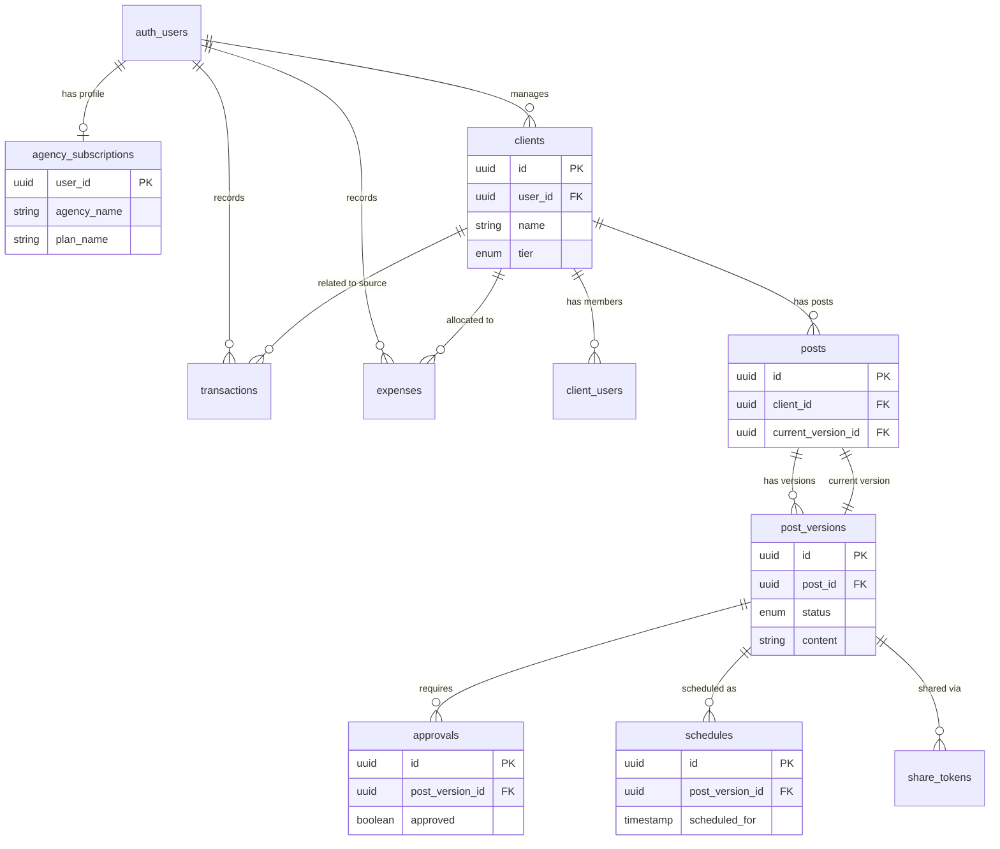

# Database Documentation

## Overview

This document serves as a reference for the Supabase database schema used in the Social Media Management application. The project ID is `ockvcyevnozuczzngrwg`.

## Enums

The database uses the following custom ENUM types:

### `client_tier`

- `BASIC`
- `PRO`
- `VIP`

### `post_status`

- `DRAFT`
- `PENDING_APPROVAL`
- `APPROVED`
- `SCHEDULED`
- `NEEDS_REVISION`
- `PUBLISHED`
- `ARCHIVED`

### `transaction_type`

- `INCOME`
- `EXPENSE`

### `transaction_status`

- `PAID`
- `PENDING`
- `OVERDUE`

## Tables

## Tables

### `agency_subscriptions`

Stores workspace configuration and billing metadata for agency owners.

- **Primary Key**: `user_id` (uuid) -> `auth.users.id`
- **Fields**:
  - `plan_name` (text, default: 'PENDING'): Subscription level.
  - `max_clients` (integer): Account limit.
  - `max_storage_bytes` (bigint): Asset storage limit.
  - `current_storage_used` (bigint): Real-time usage tracking (bytes).
  - `is_active` (boolean): Whether the agency can access tools.
  - `whitelabel_enabled` (boolean): Flag for custom branding features.
  - `agency_name` (text): Display name for the agency.
  - `logo_url` (text): Branding asset link.
  - `primary_color` (text, default: '#6366f1'): UI theme color.
  - `social_links` (jsonb): Map of agency social presence.
  - `industry` (text): Niche category.
  - `platforms` (jsonb): Targeted social platforms.
  - `email` (text): Public contact email.
  - `mobile_number` (text): Public contact phone.
  - `description` (text): Agency bio/mission.
  - `created_at` (timestamptz)
  - `updated_at` (timestamptz)

#### Triggers

- **`on_storage_object_changed`**: Automatically updates `current_storage_used` based on inserts, updates, or deletions in the `storage.objects` table.

---

### `clients`

Stores profiles for external clients and the internal agency workspace.

- **Primary Key**: `id` (uuid)
- **Foreign Keys**:
  - `user_id` -> `auth.users.id` (Owner of the client/workspace)
- **Constraints & Indexes**:
  - `clients_pkey` (PRIMARY KEY): `id`
  - `unique_internal_client_per_user` (UNIQUE INDEX): `user_id` WHERE `(is_internal = true)`
- **Fields**:
  - `name` (text): Client name.
  - `status` (text, check: ACTIVE, PAUSED)
  - `email` (text)
  - `mobile_number` (text, nullable)
  - `description` (text, nullable)
  - `logo_url` (text, nullable)
  - `tier` (client_tier, default: 'BASIC')
  - `industry` (text, default: 'General')
  - `platforms` (text[], default: '{}')
  - `is_internal` (boolean, default: false)
  - `social_links` (jsonb, default: '{}')
  - `created_at` (timestamptz)

---

### `client_users`

Associates specific users with a client for team or portal access.

- **Primary Key**: `id` (uuid)
- **Foreign Keys**:
  - `client_id` -> `clients.id`
- **Fields**:
  - `role` (text, check: ADMIN, INTERNAL)

---

### `posts`

Container for social content. Actual content resides in `post_versions`.

- **Primary Key**: `id` (uuid)
- **Foreign Keys**:
  - `client_id` -> `clients.id`
  - `current_version_id` -> `post_versions.id`
- **Fields**:
  - `created_at` (timestamptz)

---

### `post_versions`

Revision history and state for post content.

- **Primary Key**: `id` (uuid)
- **Foreign Keys**:
  - `post_id` -> `posts.id`
  - `client_id` -> `clients.id`
- **Fields**:
  - `version_number` (integer)
  - `status` (post_status)
  - `content` (text)
  - `media_urls` (text[])
  - `platform` (text[])
  - `title` (text)
  - `client_notes` (text)
  - `admin_notes` (text)
  - `target_date` (timestamptz)
  - `published_at` (timestamptz)
  - `created_at` (timestamptz)
  - `updated_at` (timestamptz)

---

### `approvals`

Approval workflow for post versions.

- **Primary Key**: `id` (uuid)
- **Foreign Keys**:
  - `post_version_id` -> `post_versions.id`
  - `client_id` -> `clients.id`
- **Fields**:
  - `approved` (boolean)
  - `comment` (text)
  - `approved_by` (text)
  - `approved_at` (timestamptz)

---

### `schedules`

Scheduling metadata for approved posts.

- **Primary Key**: `id` (uuid)
- **Foreign Keys**:
  - `post_version_id` -> `post_versions.id`
  - `client_id` -> `clients.id`
- **Fields**:
  - `scheduled_for` (timestamptz)
  - `created_at` (timestamptz)

---

### `share_tokens`

Public review links for post versions.

- **Primary Key**: `id` (uuid)
- **Foreign Keys**:
  - `post_version_id` -> `post_versions.id`
- **Fields**:
  - `token` (text, unique)
  - `expires_at` (timestamptz)
  - `created_at` (timestamptz)

---

### `transactions`

Financial records for income and costs.

- **Primary Key**: `id` (uuid)
- **Foreign Keys**:
  - `user_id` -> `auth.users.id`
  - `client_id` -> `clients.id` (Optional)
- **Fields**:
  - `type` (transaction_type): `INCOME` or `EXPENSE`.
  - `amount` (numeric)
  - `date` (date)
  - `category` (text)
  - `description` (text)
  - `status` (transaction_status, default: 'PAID')
  - `invoice_url` (text)
  - `created_at` (timestamptz)

---

### `expenses`

Recurring operational costs.

- **Primary Key**: `id` (uuid)
- **Foreign Keys**:
  - `user_id` -> `auth.users.id`
  - `assigned_client_id` -> `clients.id` (Optional)
- **Fields**:
  - `name` (text)
  - `cost` (numeric)
  - `billing_cycle` (text, check: MONTHLY, QUARTERLY, YEARLY)
  - `next_billing_date` (date)
  - `category` (text, default: 'Software')
  - `created_at` (timestamptz)
  - `updated_at` (timestamptz)

---

### `view_client_profitability` (View)

Aggregates financial performance per client.

- **Columns**:
  - `client_id` (uuid)
  - `total_revenue` (numeric)
  - `one_off_costs` (numeric)
  - `monthly_recurring_costs` (numeric)

## Entity Relationship Diagram

